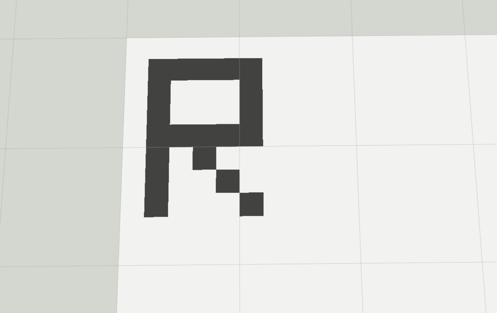

# Sensor Data Fusion
Grid Map ROS Exercise to generate a grid map using the data from an laser scanner, using a probabilistic approach for calculating the occupancy probability.

## Goals of the exercise
- [x] Generation of a chess board as grid map  (completed)
- [x] Generation and Visualization of a gridmap based on a laser scanner sample (completed)
- [x] Generation and Visualization of a gridmap based on a laser measurement (from rosbag) (completed)


Firstly, for setting up the environment, the following code is run on the terminal.
```
    colcon build –packages-select sensor_data_fusion
    source install/setup.bash
```
Part 1 has been implemented with the checkered gridmap and the first letter of the name
The checkered grid map can be found with the entry point below. RVIZ2 is used for the visualization

```
    ros2 run sensor_data_fusion hsc_gridmap
```

<div align="center">
    
</div>

---

The grid map with the first letter of my name can be found with the entry point given below.

```
    ros2 run sensor_data_fusion hsc_gridmap_name
```

<div align="center">
    
</div>

---

Part 2 has been implemented, to generate and visualise the gridmap for a sample laser scan, with the entry point given below.

```
    ros2 run sensor_data_fusion hsc_mapping_sample
```

<div align="center">
    
</div>

---

For part 3, we also have to play the bag file and then subscribe to the published messages.

```
    ros2 run sensor_data_fusion hsc_mapping_laser
    ros2 bag play /.../ros2_ws/src/R_0_0.db3
```

<div align="center">
    
</div>

---


## Subtasks

- [x] gridmap_hsc.py - Depict the general structure of the program (completed)
The general structure of the program has been depicted in the figure below.
<div align="center">
    
</div>

---

- [x] gridmap_hsc.py - Explain the parameters given to class Gridmap (completed)

### Size
Integer - Size of the grid map. The resulting grid will be a size x size square of cells<br>Example - If size = 10, then 10x10 square of cells will be the resultant.

### Resolution
Float - Sets the scale of the grid. Size of each grid cell (in m) <br> Example - If resolution = 0.1, each cell represents 0.1m<br>

### Topic Name
String - Name of the ros topic where the resultant grid will be published<br>

### p_0 
Float - Initial probability of occupancy of the cells (without sensing the cell)<br> 
Example - If p_0 is 0.5, the cells are equally likely to be free or occupied.

### p_occ
Float - Probability of the cell being occupied<br>
Example - If p_occ is 0.2, there is a 20% chance that the cell is occupied. 

### p_free
Float - Probability of the cell being free<br>
Example - If p_free is 0.6, there is a 60% chance that the cell is free. 

---

- [x] mapping_hsc.py and laserscan_sample.py - Explain the results of using different resolutions and modifying the vehicle's position (completed)

Image with resolution 0.05m
<div align="center">
    
</div> 

Image with resolution 0.2m
<div align="center">
    
</div>

Image with resolution 0.5m
<div align="center">
    
</div>

Resolution sets the scale of the grid. It is the size of the cell (represented in meters).<br>
Observations: 
1. The image with 0.05m resolution is well defined and is a higher resolution map, where each cell is 0.05 meter squared. 
More detailed and accurate representation with clear edges and finer details.<br>
2. The image with 0.2m resolution is less precise and comparatively coarser. The finer details are missing and the image looks pixelated. Some details have been lost in this resolution.
3. The image with 0.5m resolution is highly pixelated and there is a huge amount of loss in details in this resolution. 
<br>
The importance of the reference value in representing the environment accurately and in clear detail is shown. 

Image with the initial location and 0 degree rotation
<div align="center">
    
</div> 

Image with the initial location and 45 degree rotation
<div align="center">
    
</div>

Image with changed location and 90 degree rotation
<div align="center">
    
</div>

The change in location and rotation of the vehicle can be observed with the above images. The vehicles were initially positioned at the center of the image with the product of resolution and size being divided by 2. The third image shows the changed location with the same product being divided by 4. 
